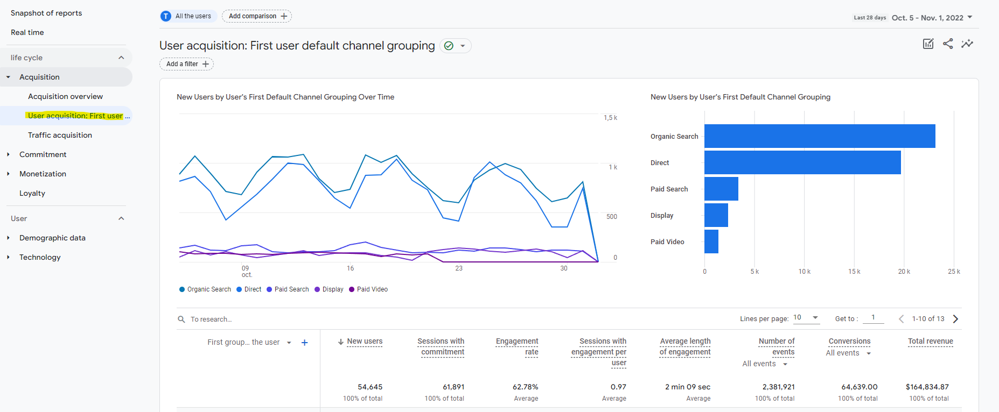
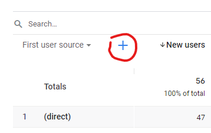
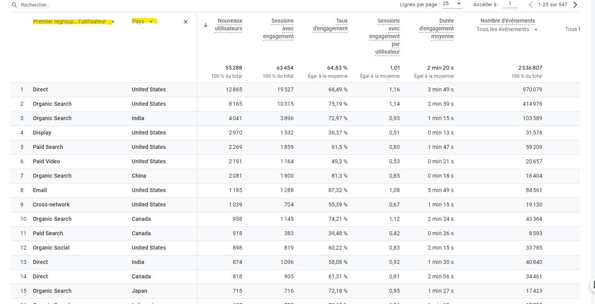

# What is a dimension in GA4? A Few Examples

Google Analytics is a tool designed to collect data. To know what the data represents, we use dimensions.
For example, when a user browses a web page, Google Analytics measures the following dimensions:
- The URL of the page
- Day and time
- The the user's location, distributed over several dimensions: continent, country, city, etc.
- Possibly dimensions describing the original source of the user (campaign, medium, )
- etc.

Quick reminder: in GA4, unlike Universal Analytics, a page visit is represented by an event.

Now let's see how we can visualise these dimensions in our reports on GA4.

# Use dimensions in reports on GA4

The reports available by default in GA4 are simply used to view the dimensions present by default, grouped by category. Let's see, for example, the "User Acquisition" report:

In this report we can see, arranged in a line, the values defined for an acquisition dimension, the *First user default channel grouping*. This dimension represents the group of origin of the first interaction with a user: organic search (Organic Search), sponsored search (Paid Search), direct traffic, etc.
The columns show us the different *metrics* related to this dimension: number of new users, sessions with engagement, conversions, etc. 

The acquisition report allows you to see these same metrics linked with other dimensions: source of the first interaction, first ad group of the user, and more.

This report therefore allows you to see the acquisition and promotion techniques that work best. We can answer questions such as: what is my most effective promotional campaign? Does organic traffic generate more conversion than traffic from promotional campaigns, and so on.

## Secondary Dimensions

You can also add secondary dimensions to group the dimensions into subcategories:

In the example below we have aggregated users by first grouping by default, and by country (the country is the secondary dimension):

Don't hesitate to explore the other reports to observe the multiple dimensions at your disposal.

# Some default dimensions to know on GA4

By default, Google Analytics 4 provides us with a wide range of dimensions. You can see a complete list in the [official Google documentation](https://support.google.com/analytics/answer/9143382).
Let us see some of these dimensions in details.

## Where do your users come from? Attribution dimensions and traffic sources

Attribution and traffic source dimensions help identify users and sessions based on criteria such as:
- Marketing campaigns used for acquisition
- acquisition support (email, CPC, etc.)
- source (the publisher or the source of inventory having generated traffic)
- data relating to Google Ads or Search Ads 360:
- account name
- ad group
- keyword
- query
- etc.
- data relating to creatives on [Google Display & Video 360](https://support.google.com/displayvideo#topic=9059505)

Attribution dimensions are user-driven, while Traffic Source dimensions are user-driven and session-driven.

## Understanding your Visitors - Demographics, Geographies and Device

In order to best serve our customers, we need to know who they are. Identifying customers by certain criteria can help us know if our app is serving the right people, understand how people from different backgrounds use our app, compare different populations, and more.

For example, you can use the dimensions of demographic data automatically deduced by Google, after having [activated Google signals](https://support.google.com/analytics/answer/7532985):

- Age
- Gender
- Hobbies

The geographical origin of visitors is measured with the following default dimensions:

- City/City ID
- Continent and subcontinent/ID [UN M29](https://en.wikipedia.org/wiki/UN_M49) of subcontinent
- Country/ID [ISO 3166](https://en.wikipedia.org/wiki/ISO_3166) of country
- Region/Region ID

We can also know what type of platforms are used to navigate our application. It's very useful to provide the best user experience. For example, if we know that 90% of our visitors are on a tablet device with a relatively low screen resolution, we will favor optimization for this configuration (or try to understand why users prefer this option, which may reveal a problem on other platforms).
The Platform/Device dimensions to consider are:

- Browser
- Device
- Device category (mobile, tablet or computer)
- Operating system
- Platform ("Android", "iOS" and "Web")
- Screen resolution

**Important note**: make sure you have users' consent in advance (using the appropriate GDPR tools) before recording this type of personal data.

## Know what your users are doing - events, page/screen, and user lifetime

Now let's move on to the details of user actions on our application.
For events, we have two key dimensions at our disposal:

- Event name
- Is it a conversion event ("true" if the event is a [conversion](https://support.google.com/analytics/answer/9267568))

To know what type of page or screen our users are on, we have, among others, the following dimensions at our disposal:

- Page location (page URL or screen)
- Page referrer (the previous page in the user's journey, which can be on your site or another site)
- Page title

**Engagement metrics** will be used to measure data such as time spent on page.

Finally, to find out if visitors are loyal and often return to the application, we can use "User lifetime" type dimensions such as:

- Date of the first session
- Date of first visit
- Date of last activity
- Date of first purchase
- Date of last purchase

## Measure the commercial performance of your application - E-commerce dimensions

Finally, if you have an e-commerce site, Google Analytics provides you with a large number of dimensions to describe the products you sell, such as:
- Currency
- Item brand
- Item category (with 5 levels of hierarchy for your subcategories)
- Discount voucher for the item
- Item ID
- Item name
- Local price of the item
- Shipping tier	(by road transport, by air, next day, etc.)
- Tax amount
- Transaction ID
- etc.

# Dimension activation and monitoring

To create reports that suit your needs, you will need to enable and test the necessary dimensions. Some dimensions are activated and populated by default, but others, depending on the data collected, must be activated in a specific way.
Refer to the [Google documentation](https://support.google.com/analytics/answer/9143382?hl=fr) to find out how to activate each dimension.

To see at a glance which dimensions are available on your property, use the [dimensions and metrics explorer provided by Google](https://ga-dev-tools.web.app/ga4/dimensions-metrics-explorer/).

What dimensions do you use for your Google Analytics reports and why? Feel free to share your experiences!