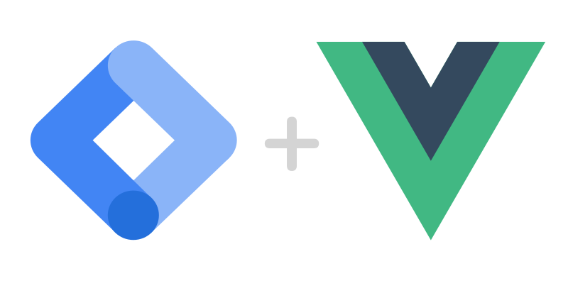
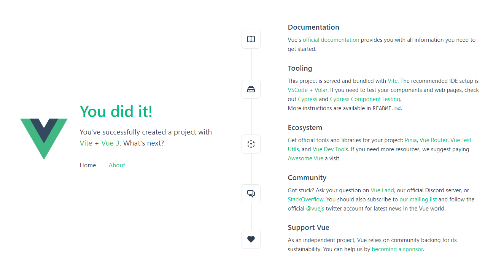

<div class="centre">

</div>

In this series I'll show you how to kickstart your analytics configurations with [Google Tag Manager](https://tagmanager.google.com/) when you create a Single Page Application using [Vue.js](https://vuejs.org/). The goal is to track what's happening in your application to improve it over time, using the datalayer and Google Analytics.

We'll be using TypeScript, but it should be easy to retrofit most of it to JavaScript.
When we're done, you'll have a SPA fully integrated with Google Tag Manager, using routing to track "page views", a simple GDPR banner, and custom events tracked into Google Analytics via Google Tag Manager.
The first post of the series will show you how to create a simple Vue.js app, then install and configure Google Tag Manager on it.

To begin with, you'll need your standard modern JavaScript weaponry:
- Node
- NPM or Yarn
- The command line

Vue has a great command line utility you can use to scaffold your project with minimal effort. To install this, start by running this command:

```shell
npm init vue@latest
```

It will kick-start your new application. 

Start by entering your project name, then:
- select "yes"  to add TypeScript, 
- choose if you want JSX support (not essential for this tutorial, but you might want it for your own application), 
- select "yes" to add Vue Router for Single Page Application development (more about that below), 
- add [Pinia](https://pinia.vuejs.org/) for state management (optional), 
- choose the other options as shown below:

```shell
✔ Project name: … <your-project-name>
✔ Add TypeScript? … No / Yes
✔ Add JSX Support? … No / Yes
✔ Add Vue Router for Single Page Application development? … No / Yes
✔ Add Pinia for state management? … No / Yes
✔ Add Vitest for Unit testing? … No / Yes
✔ Add Cypress for both Unit and End-to-End testing? … No / Yes
✔ Add ESLint for code quality? … No / Yes
✔ Add Prettier for code formatting? … No / Yes

Scaffolding project in ./<your-project-name>...
Done.
```

If you want to create another project later, run `npm create vue@3`, and you'll see the same options for your next app. [Check the full documentation](https://vuejs.org/guide/quick-start.html#creating-a-vue-application) on Vue's official site.
We're now ready to set up GTM on our newly created app!

## Set up a new Google Tag Manager Container

Next, you'll need a GTM container. Follow the instructions in [Google Tag Manager](https://tagmanager.google.com/) to create a new container, and keep track of your container ID for later use. Check out [this excellent article from Julius Fedorovicius](https://www.analyticsmania.com/post/google-tag-manager-id/) to learn more about the GTM container ID.

## Install and configure Vue GTM 

We now have a very simple SPA to work with. Navigate into your app's root folder and run `npm run dev` to see it in your browser.

<div class="max-w-2xl">
  
</div>

## Configuration 

Now we need to configure our application so that it sends data to our GTM container. 
Open `main.ts`, and edit it to look like this:

```javascript
import { createApp } from 'vue'
import { createPinia } from 'pinia'
import { createGtm } from '@gtm-support/vue-gtm';

import App from './App.vue'
import router from './router'

import './assets/main.css'

const app = createApp(App)

app.use(createPinia())
app.use(router)
app.use(
  createGtm({
    id: "<Your GTM ID>",
    vueRouter: router
  })
)
app.mount('#app')
```

References to Pinia are, of course, optional.

This is our most basic configuration for GTM on a Vue application. We hook our app to an instance of `createGtm` with two simple options: 
- the GTM ID we mentioned above. This connects our GTM account to our app.
- a reference to the router currently in use. This specifies that we're using our app's router to track page views (`vueRoute: router`). To see how the router is configured, open `router/index.ts`. 

There are several other options; we'll explore them in [the next post](/blog/gtm_vue_part_2).