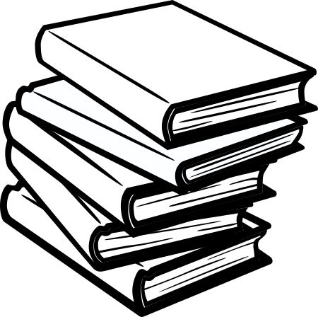

If you want to become a well-rounded engineer, you have to study across multiple fields of knowledge. In practice, this means you're going to read. A lot. 

Start with books; books have been a valuable source of knowledge for centuries, and I don't believe that's going to change anytime soon. Most of the information available is still published in books, and a lot of it isn't available online yet.

Then there's web-based resources: blogs, online magazines, newsletters, tutorials, etc. The sky is the limit when it comes to learning online, but few people truly take advantage of it.

Here's how you can read better, and get the most out of your reading.

## Make learning and reading a habit
If you want to learn a lot, reading shouldn't be something you used to do in school. It should become a habit, an integral part of your personality.  

**Forget speed-reading. Forget yearly reading challenges. Nobody cares if you've read a book every week last year. Just read**. Learn. As often as you can.

Here's a simple system that will get you reading more every day:
- Have a book or an article with you everywhere you go: on your phone or tablet (use the Kindle app for books and [Pocket](https://getpocket.com) for articles), in paper form, etc.
- Read whenever you have a few spare minutes. Keep track of your progress. You'll be amazed by the amount of information you manage to absorb over time.

That's it. That's all you need. Remember: [process over goals wins every time](https://jamesclear.com/goals-systems)

> The only way to actually win is to get better each day. [...] If you want better results, then forget about setting goals. Focus on your system instead.
> James Clear.

## Understand the context of what you're reading, adjust accordingly

Don't read a complex scientific paper the same way you browse the news. This seems obvious, but it will transform the way you read anything.

Before you read anything, make sure you check a few things:
1. Who's the writer?   
You'll need to have at least some idea of the **two Bs: Bio and Bias**. Who are they? Why are they writing this, and what's their background? How does their personal experience affect their writing? How does your personal bias with them affect your reading? It seems like this should only apply to personal articles and the humanities, but even the hard sciences have their bias. To be biased is to be human.
2. Who's the publisher?   
The publisher is the author's facilitator, their platform. They bring their own skills and biases to the mix. A good publisher is crucial to the quality and success of a book. Learn to identify the top publishers and websites or newsletters in the fields you're learning about.
Anyone can publish anything online, which means quality varies greatly. This makes online publishers all the more relevant. Before reading an online resource, ask yourself a few questions. Is your article published in a well-known online resource, such as an established newspaper or a respected tech newsletter? Or is it just published in a blog under the writer's own name? 
Keep in mind, just because a post is published on a personal blog doesn't make it bad (I hope this very article demonstrates this). It just means that no third party reviewed the article before publication, and that the author's biases and blind spots may have been missed.
3. When was this published?  
Older books are a product of their time, and you need to understand them in their proper context, not judge them based on today's standards. You also need to account for out-of-date information, and update your knowledge accordingly.
Online resources are especially prone to obsolescence, especially when it comes to tech. Make sure that the tutorials you use work with the latest version of whatever framework you're using.

This process may seem quite tedious, but in practice it only takes a few moments, and gets faster with practice. And remember, we don't care about speed-reading here. Besides, the techniques I describe in the next section will show you how you can absorb a text much faster, and much deeper.

## Use and abuse table of contents, glossaries and indexes 

This is *the* key to effective reading: become an active and demanding reader, don't just passively absorb the text from start to finish. 

Start with the table of contents, always. Use it to understand the structure of the book, and pick the parts that interest you most. Ask questions, make a note, and go check how the book answers them. Before you read an article, skim it, use the headlines and paragraphs to understand it's structure.

Then, look at the index to find connections to keywords you already know about, or look for words you never encountered and indulge your curiosity.

Here is something most people, astonishingly,  never learn at school: **you do not have to read anything in a specific order**. This is **your** book, **your** article, **you** can pick and choose which bits you want to read, in whatever order you want. This is called **active reading**, a criminally neglected skill. Make that a habit and you got yourself a superpower.
Over time, doing this will enable you to go through books quickly, jumping straight to0 parts that are relevant to your current research, leaving out the rest. Learning were to find the information you need later if needed.

This is how to "consume" information. In the next sections we'll have a look at how to "digest" it, aka memorisation.

## Learn the three secrets to memorising what you read

Most people struggle to remember what they read, which is why they give up on reading altogether after school. And who can blame them? It seems like a waste of time. The good news is, with **active reading**, described above, you're already memorising a lot more. 

That's the first secret to memorising what you read: **become a demanding reader: keep asking questions as you read, and look for answers**. 

The second secret is also part of the active reading process: **connect what you read to what you already know**. The brain works by making connections: that's why rote memorisation doesn't work well: if there's nothing to "peg" onto a bland list that has no context for you, the brain just forgets. That's also why knowledge compounds so well: if you know a little about a lot of different subjects, you have more connections to make and you can "go deep" on many topics very quickly. That's a polymath superpower.

The third secret is a bit more involved, but worth the effort: **use spaced repetition to keep your knowledge alive**. Explaining spaced repetition in detail is out of the scope of this post, but in a nutshell it's using computerised flash cards every day. Each card is revised at increasingly long intervals, based on a specialised algorithm. 

I recommend using [Anki](https://apps.ankiweb.net/) to get started: it's free and has all the features you're likely to need. Read [this post to learn the basics of  Anki](https://leananki.com/how-to-use-anki-tutorial/) .

## The golden rule of reading and learning

Here's something else we never learn about reading in school: in the real world, **you do not have to keep reading anything that's not valuable to you**. You're also allowed to read whatever the hell you want. **There are no assignments or "required reading" in life, just the [pleasure of learning](https://supermemo.guru/wiki/Pleasure_of_learning).** 

Never, ever let anyone shame you for what you're reading or not reading, or how you're reading it. You're free.
Once again, just read and learn. As fast or as slowly as you please. And if the book, the blog post or the magazine isn't for you, just put it back on the shelf. Maybe later. Maybe never. You're free.

What matters, always, is that you just keep going. Don't stop learning, ever.

> Don't let schooling interfere with your education.
> Mark Twain

What are you reading at the moment? Let me know !

### Recommended reading
- [The Lifetime Learner's Guide to Reading and Learning](https://www.amazon.co.uk/Lifetime-Learners-Guide-Reading-Learning-ebook/dp/B073VBZCS8/) by Gary Hoover  
Book lover [Gary Hoover](https://hooversworld.com/gary-hoover/) lives in a 33-room building, of which 32 contain his 57,000-book personal library. Few people have “consumed” or learned from and remembered as many books. In The Lifetime Learner’s Guide to Reading and Learning, Gary lays out his method for capturing important ideas contained in books in 30 minutes (or less) without speed-reading. 
- [How to Read a Book](https://www.amazon.co.uk/How-Read-Book-Intelligent-Touchstone-ebook/dp/B004Z0TU0W) by Charles Van Doren and Mortimer Adler  
Originally published in 1940, this book is a rare phenomenon, a living classic that introduces and elucidates the various levels of reading and how to achieve them—from elementary reading, through systematic skimming and inspectional reading, to speed reading. Readers will learn when and how to “judge a book by its cover,” and also how to X-ray it, read critically, and extract the author’s message from the text.

